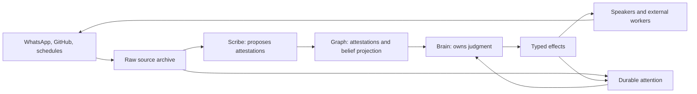

# Architecture

## Purpose

Ambient Agent is one coworker in the felt experience: one identity, one memory, and one point
of view across many conversation surfaces. It is multi-agent internally, but its parts have
strictly different authority.

This document defines the target system and its code ownership. `STATUS.md` records how much
of it actually exists.

## First principles

1. **One coworker, many surfaces.** A person encounters one colleague, not a collection of bots.
2. **The Brain decides; Speakers converse.** Global judgment and local expression are separate.
3. **State has one owner.** Each durable fact has one authoritative application module.
4. **Raw sources remain truth.** The Graph derives meaning without replacing Conversation
   Archive or GitHub history.
5. **Admission is durable and non-blocking.** Accepted work survives interruption; callers do
   not wait for global reasoning.
6. **Effects are explicit.** A model proposes typed consequences; trusted code validates,
   records, executes, and receipts them.
7. **Recovery is a normal path.** Stable application identity survives processes, models,
   retries, and deployment hosts.
8. **One tenant is the first complete unit.** Hosting many tenants composes isolated runtimes;
   it does not put every tenant inside one global Brain.

## System flow



The archive and Graph persist. Attention is durable processing state: it is consumed when a
Brain decision settles, while the source event and decision receipt remain queryable.

## Target repository

Directories appear only when their build introduces real code.

```text
ambient-agent-v2/
├── apps/
│   ├── runtime/             # one tenant's executable composition root
│   └── control-plane/       # Build 5: provisions isolated runtimes
├── packages/
│   ├── coworker/            # application truth and domain use cases
│   │   └── src/
│   │       ├── archive/
│   │       ├── knowledge/
│   │       ├── attention/
│   │       ├── brain/
│   │       ├── effects/
│   │       ├── surfaces/
│   │       └── work/
│   └── agents/              # Flue agent definitions and prompts
├── evals/                   # datasets, graders, runner, benchmark reports
├── docs/
└── scripts/
```

## Dependency laws

```text
packages/coworker  -> Node/SQL primitives only
packages/agents    -> Flue + packages/coworker
apps/runtime       -> packages/* + WhatsApp/GitHub/database adapters
apps/control-plane -> provisioning contracts over the network
```

- `packages/coworker` must not import Flue, `whatsappd`, Octokit, or deployment machinery.
- `packages/agents` must not open databases or call provider SDKs directly.
- `apps/runtime` is the only place that wires external adapters into application ports.
- `apps/control-plane` must not import runtime internals or participate in a tenant's Brain.
- Capabilities enter as cohesive domain modules, not generic command envelopes.

## Coworker application boundary

The tenant runtime constructs one Coworker and admits normalized source input through one
application use case:

```ts
const coworker = createCoworker({ databasePath, surface });
await coworker.admitConversationEvent({ id, surfaceId, text });
```

Archive, Scribe extraction, Graph projection, Attention, Brain batching, effect execution,
transactions, and recovery stay behind that boundary. The lower-level spine entry point exists
only for the synthetic interruption proof; runtime adapters must not coordinate those owners.

## Runtime topology

One tenant runtime contains one Coworker:

```text
tenant runtime
├── one Brain
├── one global Scribe clock
├── one Speaker per active Surface
├── one tenant SQL database
└── provider adapters
```

The Node process is replaceable. Durable identity, attention, conversations, effects, and
provider sessions are not process memory.

## Persistence ownership

Each tenant uses one physical SQL database. Logical ownership stays explicit:

| Owner | Durable records |
|---|---|
| Archive | immutable normalized source events |
| Knowledge | attestations and deterministic belief projection |
| Attention | admitted inputs, batches, scheduled wakes |
| Effects | effect intents, attempts, outcomes, idempotency |
| Surfaces | stable surfaces, bindings, deliveries |
| Work | external job identity and lifecycle |
| Flue adapter | canonical agent conversations and accepted dispatches |
| WhatsApp adapter | provider authentication/session material |

Sharing one database does not permit cross-module table writes. Cross-owner changes go through
the Coworker application boundary and transactions defined by the owning modules.

## Brain, Scribe, and Speaker

- **Brain:** the only global judgment authority. It reads Graph and attention, then chooses
  silence, a Directive, a work dispatch, or another typed effect.
- **Scribe:** a stateless extraction role on a global ingestion clock. It proposes
  evidence-bearing Attestations and never decides or speaks.
- **Speaker:** one continuing conversational agent per Surface. It can converse locally and
  escalate an Intent; it cannot mutate global knowledge or launch work.

## Extension rule

A new provider adds:

1. a raw-source adapter into the Archive;
2. optional Surface bindings;
3. typed effect executors;
4. focused scenarios and evals.

It does not add another Brain, Graph, or generic routing layer.
