# Build plan

## Outcome

Build one clean, understandable Coworker in independently runnable increments, then replace
the existing system in one controlled production cutover.

Every build must be:

- runnable from a clean checkout;
- mechanically checked in CI;
- demonstrated by one concrete scenario;
- evaluated at the proof level appropriate to its boundary;
- honest in `STATUS.md`;
- independently reversible before the production cutover.

## Dependency DAG

```mermaid
flowchart LR
  B0["Build 0: repository foundation"] --> B1["Build 1: durable Flue floor"]
  B1 --> B2["Build 2: synthetic coworker spine"]
  B2 --> B3A["Build 3A: real-model coworker"]
  B3A --> B31["Build 3.1: Conversation Intake"]
  B31 --> B32["Build 3.2: safe Surface delivery"]
  B32 --> B33["Build 3.3: Brain and Speaker identity"]
  B33 --> B34["Build 3.4: thin WhatsApp adapter"]
  B34 --> B35["Build 3.5: live proof"]
  B35 --> B3["Build 3: live WhatsApp coworker"]
  B3 --> B4["Build 4: GitHub work loop"]
  B4 --> B5["Build 5: hosted tenant isolation"]
  B5 --> C["Production cutover"]
```

## Build ledger

| Build | Outcome | Runnable proof | Environment |
|---|---|---|---|
| Build 0 | Repository and executable plan | `pnpm check` | local + CI |
| Build 1 | One durable Flue v2 Node agent survives interruption | `pnpm demo:recovery` | local + CI |
| Build 2 | Archive → Scribe → Graph/Attention → Brain → Effect works synthetically | `pnpm demo:spine` | local + CI |
| Build 3A | Real Scribe → Brain → Speaker inference drives the synthetic Surface | `pnpm demo:real-model` | local P4 |
| Build 3.1 | Normalized intake archives all events and admits only bound inbound arrivals | `pnpm demo:intake` | local + CI |
| Build 3.2 | Surface delivery is durable and uncertain attempts are never retried blindly | `pnpm demo:delivery` | local + CI |
| Build 3 | One real WhatsApp Surface converses and recovers | `pnpm demo:whatsapp` | local + isolated staging |
| Build 4 | Brain-owned GitHub work completes and returns | `pnpm demo:github` | local + isolated staging |
| Build 5 | Control plane provisions two isolated tenant runtimes | `pnpm demo:tenant` | local + hosted staging |
| Production cutover | Replacement becomes the only live runtime | cutover receipt | production |

Commands after Build 0 are contracts: each build introduces its command and must leave it
working for later builds.

## Build 0 — Repository foundation

### Delivers

- repository/workspace configuration;
- architecture and dependency laws;
- ratified domain language;
- this build ledger and its dependencies;
- proof and receipt contract;
- local/staging/production environment strategy;
- evaluation and model-benchmark methodology;
- ADRs for settled architecture decisions;
- production coexistence, cutover, and rollback contract;
- a clean CI check requiring no application credentials.

### Excludes

- application packages, external SDKs, schemas, credentials, deployments, and placeholder code.

### Exit gate

`pnpm install --frozen-lockfile && pnpm check` passes locally and in CI. A reviewer can answer
what each later build owns, runs, proves, and explicitly does not prove without consulting the
old repository.

## Build 1 — Durable Flue v2 Node floor

### Delivers

- `apps/runtime` as a Node composition root;
- `packages/agents` with one minimal real Flue agent;
- one supported durable SQL adapter targeting the tenant database;
- stable conversation identity;
- accepted prompt/dispatch recovery after forced process interruption;
- health and authorized inspection sufficient to prove recovery.

### Scenario

Start one agent conversation, interrupt the process after durable admission, restart against
the same database, and observe exactly one terminal continuation for the same application
identity.

### Exit gate

- deterministic recovery tests pass;
- the built Node artifact performs the scenario locally;
- a receipt records admission, interruption point, restart, terminal result, and duplicate
  count;
- no WhatsApp, GitHub, Brain, Scribe, Graph, or multi-tenant claim is made.

## Build 2 — Synthetic coworker spine

### Delivers

- `packages/coworker`;
- one application-owned database schema organized by explicit table ownership;
- immutable source Archive;
- Scribe proposals with non-empty evidence;
- deterministic Graph projection;
- durable attention and stable Brain Batch membership;
- one Brain decision producing one typed, idempotent effect;
- a synthetic Surface/Speaker adapter;
- the initial `evals` package and benchmark runner.

### Scenario

Submit a synthetic conversation event, archive it, extract an Attestation, admit attention,
run one Brain decision, execute one fake effect, interrupt at each durable boundary, and prove
the final state is equivalent with no duplicate external effect.

### Exit gate

- architecture dependency laws are explicit and checked during PR review;
- deterministic and recorded-fixture eval tiers pass;
- interruption matrix passes;
- no provider credential or hosted-runtime claim is made.

## Build 3A — Real-model coworker

### Delivers

- one Flue agent each for the global Scribe, one Brain, and a reactive Speaker;
- one OpenAI-compatible OpenCode Go provider configured only from local environment;
- schema-validated Scribe evidence, Brain objective, and Speaker expression;
- trusted application construction of stable Attestation and Effect identities;
- one P4 receipt with provider response IDs, token usage, structured role outputs, finalized
  database hash, and explicit exclusions.

### Scenario

Admit one synthetic Conversation Event, return immediately, then resume durable Attention.
The event crosses a real Scribe model call, a real Brain model call, and a real Speaker model
call before trusted code records and delivers one synthetic Say effect.

### Exit gate

- deterministic CI remains credential-free and reports the live test as skipped;
- `OPENCODE_GO_API_KEY=<redacted> pnpm demo:real-model` passes locally;
- all three role calls carry real provider response IDs and non-zero token usage;
- the application settles one effect with zero duplicate Surface deliveries;
- model-output replay after process interruption, WhatsApp, hosted runtime, and human
  acceptance remain explicitly unproven.

## Build 3 — Live WhatsApp coworker

Build 3 begins only after the smaller real-model boundary above is proven. This keeps model
integration failures separate from WhatsApp transport and session failures.

Build 3 advances through five separately reviewable stages:

1. **3.1 Conversation Intake:** typed provider-neutral events, immutable Archive, minimal
   Surface Binding, stable trusted event identity, archive-only unauthorized/non-arrival
   events, and `pnpm demo:intake`.
2. **3.2 Safe Surface delivery:** `pending → attempting → sent | failed | uncertain`; uncertain
   delivery is never retried blindly, failed/uncertain outcomes create new Attention, and
   `pnpm demo:delivery` proves the four synthetic terminal/restart paths.
3. **3.3 Brain and Speaker identity:** one `brain-global` conversation and one continuing
   `speaker-${surfaceId}` conversation per active Surface.
4. **3.4 Thin WhatsApp adapter:** pairing/resume, session storage, status, event normalization,
   plain-text send, and provider acknowledgement only. Authorization, Archive, Attention,
   model, and delivery state remain application-owned.
5. **3.5 Live proof:** local tmux pairing with a dedicated development account, then isolated
   staging restart/soak and explicit human acceptance.

### Delivers

- `whatsappd` adapter in `apps/runtime`;
- a dedicated development WhatsApp identity;
- pairing and durable provider session storage;
- normalized source-event archival before managed-Surface admission;
- one continuing Speaker per active Surface;
- Say delivery receipts and uncertain-delivery handling;
- staging service packaging and restart operation.

### Scenario

Pair a development account, exchange messages in one test Surface, prove Archive-before-
admission, restart the service, continue the same Surface/Speaker identity, and demonstrate
that an unauthorized chat is archived but not admitted.

### Exit gate

- local provider scenario passes;
- isolated staging survives a service restart and bounded soak;
- operator verifies the real WhatsApp send/receive behavior;
- production WhatsApp credentials remain untouched.

## Build 4 — GitHub work loop

### Delivers

- one development GitHub App installed only on sandbox repositories;
- signed webhook ingestion;
- outbound GitHub effect executors;
- Brain-owned stable work identity;
- bounded worker/reviewer lifecycle;
- terminal result return to Brain attention;
- human-visible reporting through the originating or selected Surface.

### Scenario

A test-Surface conversation becomes a Brain decision, creates one sandbox issue or PR,
handles one review outcome, records provider evidence, returns the terminal result to the
Brain, and reports it once.

### Exit gate

- signed fixture replay passes locally;
- live tunnel or staging webhook proof passes;
- retries do not duplicate GitHub effects;
- model comparison uses the frozen benchmark protocol;
- production GitHub Apps and repositories remain untouched.

## Build 5 — Hosted tenant isolation

### Delivers

- `apps/control-plane`;
- tenant, runtime, installation, configuration revision, and operation ledgers;
- network provisioning of one isolated runtime per tenant;
- secret custody and rotation boundaries;
- two-tenant isolation proof;
- deployment health and lifecycle operations.

### Scenario

Provision two tenants, give them different WhatsApp/GitHub identities, prove that each has a
separate Brain and database, rotate one tenant's configuration, and show no cross-tenant data,
work, or credentials.

### Exit gate

- two-tenant scenario and negative isolation assertions pass;
- the control plane imports no runtime internals;
- operational rollback is demonstrated in staging;
- production cutover checklist is fully rehearsed.

## Production cutover

The replacement is imported into the existing repository through one atomic unrelated-history
merge, then deployed through the procedure in `CUTOVER.md`. The old service and data remain
recoverable during a bounded rollback window.

## Planning rule

This ledger is the consistent plan. A later discovery may replan a descendant build, but it
must record the contradicted premise, preserve already-proven ancestors, update this DAG, and
state which previous claims are invalidated.
